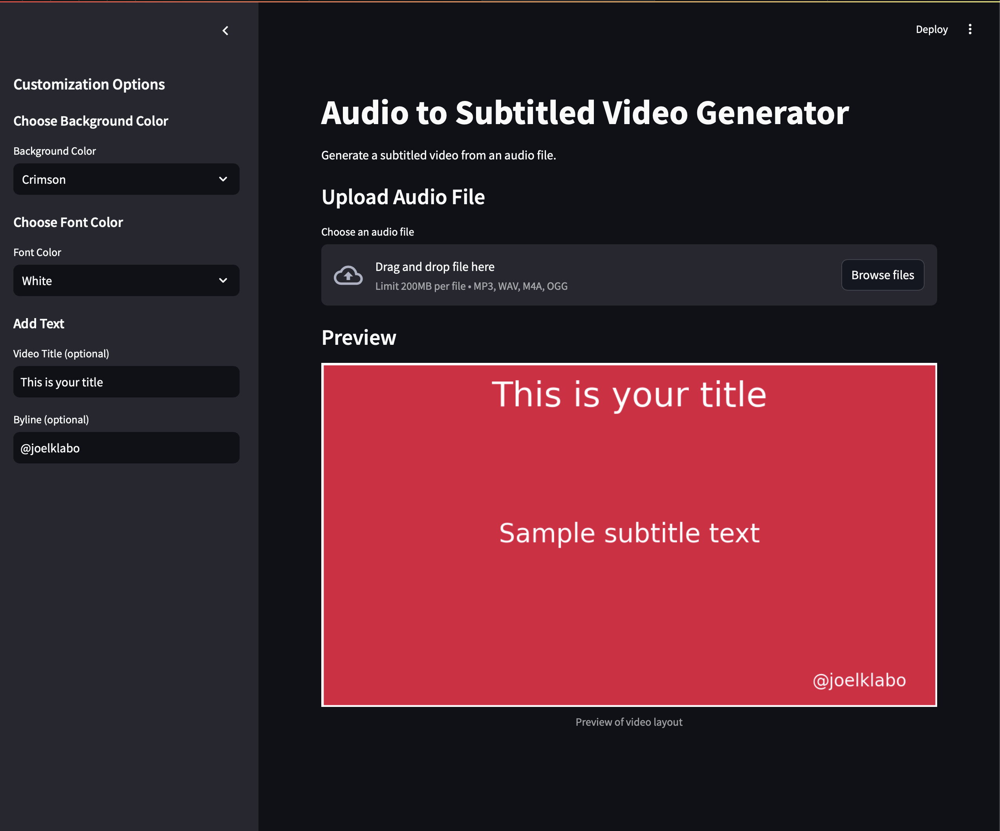

# Audio to Subtitled Video Generator

This Streamlit app creates subtitled videos from audio files using OpenAI's Whisper API for transcription.

## Screenshot



## Prerequisites

- Python 3.7 or higher
- OpenAI API key

## Python Installation

This project requires Python 3.7 or higher. If you don't have Python installed or need to upgrade, follow these steps:

1. Visit the official Python website: https://www.python.org/downloads/
2. Download the latest version of Python (3.7 or higher) for your operating system.
3. Run the installer and follow the installation instructions.
4. After installation, open a new terminal/command prompt and verify the installation by running:
   ```
   python --version
   ```
   This should display the installed Python version.

## Installation

1. Clone the repository:
   ```
   git clone <repository-url>
   cd <repository-directory>
   ```

2. Install the required packages:
   ```
   pip install -r requirements.txt
   ```

3. Set up your OpenAI API key:
   Create a `.env` file in the project root and add your OpenAI API key:
   ```
   OPENAI_API_KEY=your_api_key_here
   ```

## Running the App Locally

1. Start the Streamlit app:
   ```
   streamlit run main.py
   ```

2. Open your web browser and go to `http://localhost:8501` to access the app.

## Usage

1. Upload an audio file (supported formats: MP3, WAV, M4A, OGG).
2. Click the "Generate Subtitled Video" button.
3. Wait for the processing to complete.
4. Download the generated video with subtitles or watch it in the app.

## Note

This app requires an active internet connection to use the OpenAI Whisper API for transcription.
